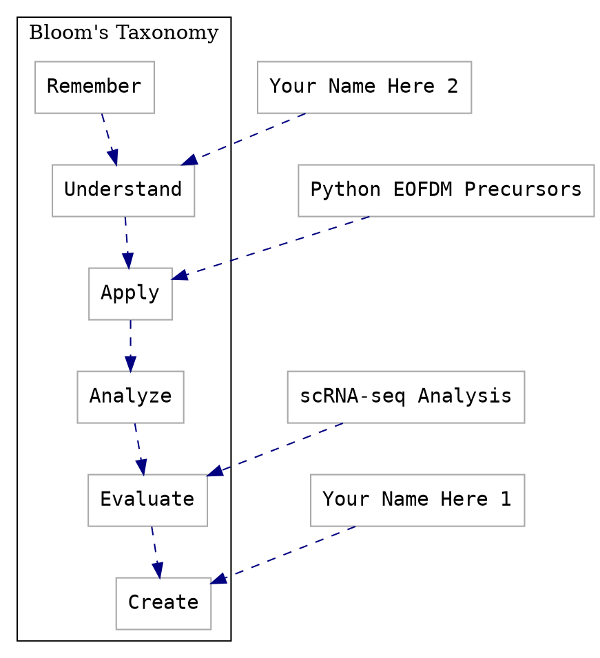
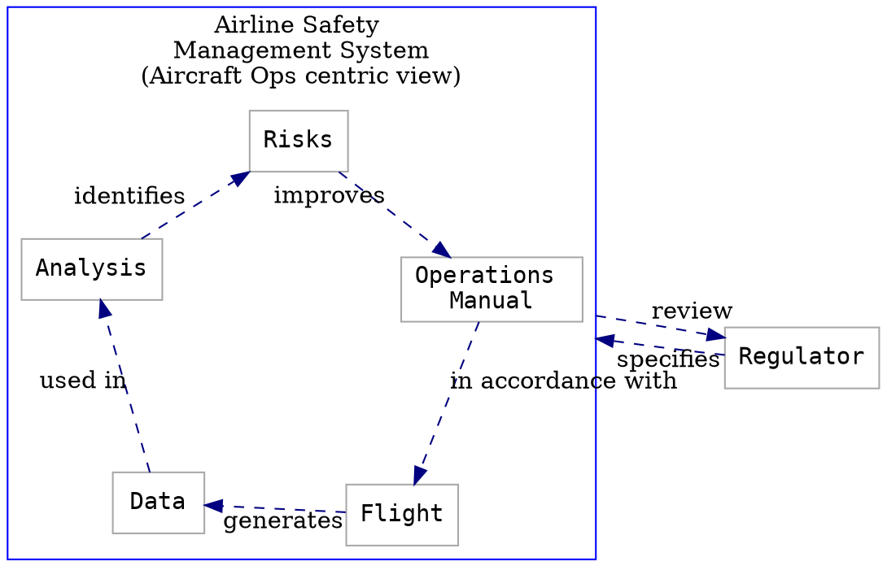

# The Carpentries Lesson Development Study Groups Notes

## Group 1: Monday 1 March 2021 14:00-15:00 UTC

This document can be used for note-taking and resource sharing during Study Group discussions.

## Important Links

1. [The Carpentries Code of Conduct](https://docs.carpentries.org/topic_folders/policies/code-of-conduct.html)
1. [Study Groups "lesson" pages](https://carpentries-incubator.github.io/study-groups/index.html)
1. [The Carpentries Curriculum Development Handbook](https://cdh.carpentries.org)
1. [Teaching Tech Together](https://teachtogether.tech/)
1. ["Index" CodiMD for this round](https://codimd.carpentries.org/ldsg1-home#) 

## Participants

Please add your name, preferred pronouns (if any), GitHub username, and (when you have it) a link to your lesson repository below. See first line for an example.

- Toby Hodges / he/him / tobyhodges / https://github.com/carpentries-incubator/jekyll-pages-novice
- Jonathan Pelham / jonititan / https://github.com/carpentries-incubator/python-EOFDM-precursors
- Batool Almarzouq / sher, her / BatoolMM / https://github.com/carpentries-incubator/scrna-seq-analysis
- Elnaz AmanzadehJajin she/her / GitHub: ElnazAmanzadeh
- Mateusz Kuzak / he, him / :octopus: mkuzak :bird: matkuzak
- Mike Trizna / he,him / MikeTrizna
- Mark Bell / he,him / mark-bell-tna
- Daniel van Strien / he, him,his/ davanstrien 
- Nora McGregor / she, her / noramcgregor 
(add more lines as needed)

## Roles

**Group Facilitator(s)**: Mateusz Kuzak, Aleks Nenadic, Serah Rono
**Discussion Lead**: Jonathan Pelham
**Notetaker**: Elnaz Amanzadeh

## Agenda

1. Welcome & Icebreaker 
    - What is your favourite food and why is it your favourite?
    - Mark: Pasta because it is fast and satisfying.
    - Batool: Sweets and chocolates instead of dinner.
    - Mike: Chicken noodle soup. Makes physically feel better.
    - Elnaz: Almost everything. Sweets and kebap.
    - Aleks: sushi (but everything really, pasta in particular)
    - Nora: Coffee.
    - Daniel: Everything but pizza is preferred.
    - Mateus: Indian foods. Safest for now. (Vegeterian)
    - Joni: Noodle and Thi food.
    
2. What are described as _lesson objectives_ in the reading material are sometimes referred to as _learning outcomes_ elsewhere in the literature. Do you prefer one of these terms to the other? Do you think either term is more appropriate to describe the skills a lesson/episode will teach? If so, why?
    - Mike: He thinks objectives are more concrete.
    - Nora: Found the reading was useful in helping to develop Lesson objectives that are specific.
    - Mateusz: In "The Carpentries's lesson objectives, teaching objectives and learning objectives come into discussion.
    - Batool: In the first Introduction episode, it'll be "Understand" beacuse we will talk about few subjects like between scRNA-seq and bulk RNA-seq , etc.In the end, we hope the learner will be able to "evaluate" and "create" their own pipline.

3. Agenda
- What level of [Bloom's taxonomy](https://carpentries.github.io/instructor-training/15-lesson-study/index.html#working-with-learning-objectives) are you aiming to acheive with students in your lesson?  Why?

```


- discussion continued...
    - Mike: Understand is important because cause people to think about where their project is going through.
    - Nora: Evaluate is a great importance.
    - Mike:Looking at other lessons of the Carpentry lessons, it seems that Evaluate is applied.
    - Mark: Taking people to the common language and solving their issues will lead them to learn new things.


- Within context of your output level did you find setting objectives challenging? (is this an apply or a create object?)
    - Mateusz: If someone goes through whole Blooms Taxonomy and complex issues, it will make it helpful. 
    - Mike: COnceptual work is better.
    - Alexandra: Did anyone find The Taxonomy hard?
    - Mike: liked the taxonomy because makes people thinking about what learners are getting and what skills they will obtain. 
    - Batool: Like the approach because makes lesson developers to change the lesson or episodes based on the requirements and priorities.

- Joni: Did you find setting objectives challanging?
    - Daiel: Yes, what objectives will learners have when they want to learn this lesson. They may have their own objectives. It is not contradictory but needs attention.
    - Mark: Picking the level we want to aim at is important and then picking th audience we want to teach(?) the lesson to.
    - Alexandra: Managing expectations is important.


- Have you changed the audience scope during your design process?
    - Nora: It happend when designing learner profiles, and going through objectives and designing introductions, scope of the audiences changed. It is better to be clear about it.
    - Mike: Setting objectives caused reduction of audience scope or not? Yes.
    - Alexandra: Did anyone get their objectives or not?
    - Spent a lot of time discussing it and exercises meet this goal.
    - Nora: We don't think our main Lesson Objectives will change much at this stage but, but as we look to individual episode objectives, these may be more fluid as we develop the episodes as external factors will have an impact the shape of the episode (length, time, etc). 
    - Batool: we as developers of this lesson, it helped to increase the scope of audience.
- Are concept maps useful?  Is there one in particular you think is a good example of the utility of mapping? 
    - Batool: Having experience in teaching in concept map but not in the lesson development. It's easier if the instructor draw it to the students rather than showing the whole concept map ta once.
    - Daniel: Concept map and exercises was discussed more than other parts.
    - Joni: Didnt use the carpentries lesson style before, so started straighforward to make the concept map.
    - Batool: graphviz was straightforward.     
    - Joni: Tried to develop the concept map as it could  be intresting.
example concept map

- Toby: Talking about teaching lesson material. 
This is an integral meet point in the lesson development and it isnt the final point of lesson development. It is important to be included. It is unrealistic to expect complete development. Between session 7 and session 8 teaching one episode will take place. Lesson teaching framework: if we lose a part of lesson and start from the next lesson, it will be great that people still will understand what are you talking about. There are 2 subgroups in this group. Format we will take is up to the group. It is important to teach to someone who will be able to give us feedback. Not necessary to make it like a workshop. An option: We ask the members of this group or other groups, to be audience of our lesson. Toby will help to publisize the lesson or make a zoomk link for the lesson. Please choose if you want it to be a private session or the public one?
    - Mike: which week this will happen?
    - Toby: The break is between 7th and 8th sessions. 23th of March and the next session.
    - Elnaz: What are the objectives of teaching in this session:
    - Toby: How effective are the exercises? Based on the feedbacks.
    - Which part did audiences find difficult to understand?
- Start to be prepared for teaching.


4. Homework

homework (ALL=a task to be done by all collaborators on a lesson; ONE=a task to be done by only one collaborator per lesson):
        - (ONE, but discuss with your collaborators first) Create placeholder files for the other episodes in your lesson. Optionally, add learning objectives to these episode files too.
        - (ALL, see link for more info) Schedule an opportunity to teach at least one episode of your new lesson. This trial run should take place between sessions 7 and 8 (23 March 2021 - 9 April 2021). See [the Episode Trial Run callout on the "lesson" page](https://carpentries-incubator.github.io/study-groups/04-objectives/#episode-trial-run) for more details.
            - Add details of your trial run to this CodiMD: https://codimd.carpentries.org/ldsg1-trial-runs#
        - (ALL) Read [Chapter 4: Designing Challenges of the Curriculum Development Handbook](https://cdh.carpentries.org/designing-challenges.html).
        - (ONE, but discuss with your collaborators first) If your lesson will use an example dataset, in the Data Set section of your Lesson Design Notes briefly describe the features and requirements an ideal dataset would have.
        - (ALL) Identify at least one appropriate example data set/narrative for your lesson, and add a link to the data set in the shared notes document.
        - (ALL) In the Data Set section of your Lesson Design Notes, briefly summarise:
            - why you chose these datasets/examples,
            - what advantages they have as a tool for learning,
            - and what disadvantages/difficulties/complexities they would introduce.

- **Weekly "Sticky Note" feedback**: please give us your feedback about this week by [filling out this two-question form][sticky-notes-link]

## Resources
Add any relevant resources you found/discussed this week to the list below.

- Graphviz syntax guide https://www.graphviz.org/documentation/
- 
- 

[sticky-notes-link]: https://forms.gle/wZDMRJbbXgyXJTJs8
